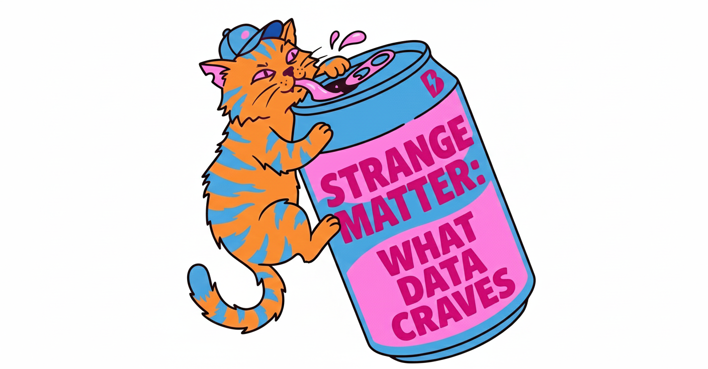

<p align="center">
  
</p>

# Strange Matter Protocol

***Strange Matter — It's What Data Craves***

**A universal protocol for composing, connecting, and preserving data across the built environment.**

Strange Matter is format, vendor, and tool agnostic. It enables people, processes, and tools with different requirements to collaborate on data that has distributed ownership, comes from different sources, and is continuously changing.

> See the [Wiki](https://github.com/magnetar-io/strange_matter_specification/wiki) for development topics and discussions.

---

## Why Strange Matter?

The built environment generates data in countless formats: BIM models, GIS data, specifications, emails, meeting notes, cost estimates, schedules, sensor readings, and more. Today, this data is:

- **Siloed** in incompatible applications
- **Serial** — each step requires the previous to be complete
- **Lossy** — metadata is lost when moving between systems
- **Disconnected** — relationships exist only in people's heads

Strange Matter solves this by providing:

| Problem | Strange Matter Solution |
|---------|------------------------|
| Data silos | **Protocol, not format** — works with any data type |
| Serial workflows | **Additive composition** — add data without waiting |
| Lost metadata | **Rich headers** — spatial context, provenance, relationships preserved |
| Disconnected data | **Context graphs** — queryable decision lineage and relationships |
| AI/ML readiness | **Native embeddings** — vector search built into the protocol |

---

## Core Concepts

### Entity

An **Entity** is the thing people care about — a building, floor, facade, column, duct, asset, or abstract concept like a relationship or requirement. An Entity can have many **Components** describing different aspects of it.

### Component

A **Component** is the smallest unit of useful data about an Entity. Components are JSON headers that reference data payloads in any format. The header provides rich metadata; the payload contains the actual data.

```
┌─────────────────────────────────────────────────────────────┐
│  COMPONENT                                                   │
│  ┌─────────────────────────────────────────────────────────┐│
│  │ HEADER (Standard, Required)                             ││
│  │ - Identity: EntityGUID, ComponentGUID, VersionGUID      ││
│  │ - Context: Project, Spatial Location, Graph Position    ││
│  │ - Metadata: Author, Dates, Status, License, Tags        ││
│  │ - Payload Info: Schema, Hash, Data Type                 ││
│  └─────────────────────────────────────────────────────────┘│
│  ┌─────────────────────────────────────────────────────────┐│
│  │ PAYLOAD (Flexible, Any Format)                          ││
│  │ - GeoJSON, IFC geometry, JSON properties, images...     ││
│  └─────────────────────────────────────────────────────────┘│
│  ┌─────────────────────────────────────────────────────────┐│
│  │ AI (Optional, Vector-Ready)                             ││
│  │ - Embeddings for semantic search                        ││
│  │ - Confidence scores and quality flags                   ││
│  └─────────────────────────────────────────────────────────┘│
└─────────────────────────────────────────────────────────────┘
```

### Protocol, Not Serialization

Strange Matter is a **protocol specification**, not just a file format. When stored in different systems, data is serialized optimally for each backend:

| Storage Backend | Payload Storage | Embedding Storage |
|-----------------|-----------------|-------------------|
| [Lance](https://github.com/lance-format/lance) | Columnar, optimized for analytics | Native vector columns with ANN indexing |
| PostGIS | Native geometry types | Vector extension |
| MongoDB | BSON documents | Atlas Vector Search |
| Parquet | Columnar with nesting | Float arrays |
| JSON files | Serialized JSON | Inline arrays |

The schema defines the contract; storage backends handle optimal serialization.

---

## Key Features

### Context Graphs

Components track their position in **context graphs** — enabling queryable decision lineage and temporal ordering.

```json
"GraphSequenceNumber": [
  "019432a1-7b2c-7def-8abc-1234567890ab:000000001",
  "019543b2-8c3d-8ef0-9bcd-2345678901bc:000000015"
]
```

This component belongs to two graphs:
- First component in Project A's graph
- 15th component in Project B's graph (reused)

> Reference: [Context Graphs: AI's Trillion-Dollar Opportunity](https://foundationcapital.com/context-graphs-ais-trillion-dollar-opportunity/) — Foundation Capital

### Spatial Context Preservation

When data moves between systems, spatial metadata isn't lost:

```json
"SpatialContext": [
  ["room", "number", "101", "name", "Conference Room A", "roomGUID", "abc-123"],
  ["level", "number", "1", "name", "Ground Floor", "elevation", "0.0"],
  ["building", "name", "Tower A", "code", "TWR-A", "buildingGUID", "def-456"],
  ["coordinateSystem", "EPSG", "2230", "statePlane", "NAD83 / California zone 6"]
]
```

### AI-Ready with Native Embeddings

Components can include vector embeddings for semantic search:

```json
"AI": {
  "Embeddings": [
    {
      "model": "text-embedding-3-large",
      "provider": "openai",
      "dimensions": 3072,
      "source": "name+payload",
      "vector": [0.123, -0.456, ...]
    }
  ],
  "Confidence": {
    "score": 0.92,
    "flags": ["ai-extracted", "human-verified"]
  }
}
```

### Lifecycle Status and Licensing

Track component lifecycle and rights:

```json
"Status": "approved",
"License": {
  "type": "proprietary",
  "attribution": "Acme Architecture LLC",
  "canRedistribute": false
}
```

---

## Component Type Naming

Types follow a self-documenting pattern: `<institution>_<format>_<datatype>`

| Type Name | Institution | Format | Data Shape |
|-----------|-------------|--------|------------|
| `Acme_geojson_polygon` | Acme | geojson | Polygons only |
| `Acme_geojson_point` | Acme | geojson | Points only |
| `Contoso_json_email` | Contoso | json | Email content |
| `HOK_json_specification` | HOK | json | Specifications |

Consumers know exactly what to expect from the name alone.

---

## Example: Clash Detection Reimagined

Traditional clash detection loses knowledge:

```
Generate Clashes → Filter Issues → Create Issue → Load in App → Temporary Join → Close App → JOIN LOST
```

With Strange Matter, relationships persist:

  ```mermaid
  flowchart LR
    Component_1 --> Clash_Relationship --> Component_2
    Clash_Relationship --> Resolution_Component --> Auto_Fix_Algorithm
```

- Query patterns across projects without opening tools
- Capture fixes in data for future similar issues
- Train ML models on resolution history

---

## Schema Overview (v0.91)

### Required Fields (19)

| Category | Fields |
|----------|--------|
| **Identity** | `ComponentType`, `SchemaVersion`, `EntityGUID`, `ComponentGUID`, `ComponentVersionGUID` |
| **Metadata** | `ComponentInfo`, `DataAuthorIdentifier`, `Name` |
| **Context** | `Context`, `GraphSequenceNumber` |
| **Classification** | `UsedAsA`, `ComponentClassification`, `Status` |
| **Identifiers** | `ForeignIDs` |
| **Temporal** | `DateCreated`, `LastModified` |
| **Payload** | `HashDefinition`, `PayloadHash`, `PayloadDataType`, `PayloadSchemaFormat` |

### Optional Fields

| Category | Fields |
|----------|--------|
| **Context** | `SpatialContext` |
| **Metadata** | `Tags`, `License` |
| **Relationships** | `Extends`, `Action` |
| **Payload** | `PayloadSchema`, `Payload` |
| **AI** | `AI.Embeddings`, `AI.Confidence`, `AI.GeneratedBy` |
| **Integrity** | `ComponentHash`, `ByteCount` |

### UsedAsA Values

| Value | Purpose |
|-------|---------|
| `Instance` | A specific real-world occurrence |
| `Typical` | A reusable template |
| `Archetype` | Requirements/specification object |
| `Relationship` | Connection between entities |
| `Group` | Logical grouping |
| `Collection` | Ordered set |

### Status Values

| Status | Meaning |
|--------|---------|
| `draft` | Work in progress |
| `active` | Current and valid |
| `pending_review` | Awaiting approval |
| `approved` | Formally approved |
| `issued` | Issued for construction |
| `superseded` | Replaced by newer version |
| `expired` | No longer valid |
| `archived` | Retained for reference |
| `deprecated` | Should not be used |

---

## Documentation

| Document | Purpose |
|----------|---------|
| [component.json](Component_Schema/v.9/Header_Schema/component.json) | JSON Schema definition |
| [component-documentation.md](Component_Schema/v.9/Header_Schema/component-documentation.md) | Detailed field documentation |
| [llm-implementation-guide.md](Component_Schema/v.9/Header_Schema/llm-implementation-guide.md) | Instructions for AI agents creating components |

---

## Design Principles

| Principle | Implementation |
|-----------|----------------|
| **Composition over Inheritance** | Entity-Component model inspired by ECS |
| **Additive, Not Destructive** | New data extends, doesn't overwrite |
| **Machine-Readable Relationships** | Relationships are components too |
| **Format Agnostic** | Any payload format works |
| **Provenance Preserved** | Full history and ownership tracking |
| **AI-Native** | Embeddings and confidence scores built-in |
| **Storage Agnostic** | Protocol works on files, databases, lakehouses |

---

## Relationships as Data

Relationships are components with relationship payloads:

```json
{
  "UsedAsA": "Relationship",
  "Payload": [{
    "source_entities": ["entity-guid-1"],
    "source_components": ["component-guid-1"],
    "destination_entities": ["entity-guid-2"],
    "destination_components": ["component-guid-2"],
    "relationship_type": "clashes_with"
  }]
}
```

Relationship types include:
- **Component to Component**: Specific elements (e.g., clash between duct and beam)
- **Component to Entity**: Data applying to whole entity (e.g., cost data)
- **Entity to Entity**: High-level relationships

---

## Collections and Archetypes

### Collection

A named group of components — like a "file" but without ownership constraints. Components can belong to multiple collections. Analogous to branches in Git.

### Archetype

A defined group of component types that serve a purpose. An owner might create an archetype specifying all data required for "Furniture" — defining what components must exist without prescribing their content.

---

## Getting Started

### For Implementers

1. Read the [Schema Documentation](Component_Schema/v.9/Header_Schema/component-documentation.md)
2. Review the [JSON Schema](Component_Schema/v.9/Header_Schema/component.json)
3. Follow the [LLM Implementation Guide](Component_Schema/v.9/Header_Schema/llm-implementation-guide.md) for component creation

### For AI/ML Integration

1. Store components in [Lance](https://github.com/lance-format/lance) for vector search
2. Generate embeddings for `AI.Embeddings` field
3. Use `GraphSequenceNumber` for context graph queries
4. Leverage `Status` and `Confidence` for data quality filtering

---

## Contributing

Strange Matter is in active development. See the [Wiki](https://github.com/magnetar-io/strange_matter_specification/wiki) for:

- Current development topics
- Proposed extensions
- Implementation examples
- Community discussions

---

<p align="center">
  
</p>

---

## License

[License information to be added]

---

*Strange Matter: Making data more than the sum of its parts.*
